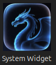
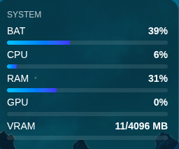

# 🖥️ Ubuntu System Monitor Widget

A lightweight, always-on-top desktop widget built with **Electron** that displays real-time system statistics directly on your Ubuntu/Linux desktop — with a clean glassmorphism UI and no distractions.

---

## 📸 Screenshots

| Widget View | System Tray |
|---|---|
|  |  |

> _Place your screenshots in a `/screenshots` folder and update the paths above._

---

## ✨ Features

- 📊 **CPU Usage** — real-time percentage with progress bar
- 🧠 **RAM Usage** — used/total memory with progress bar
- 🎮 **GPU Usage** — live utilization via `nvidia-smi`
- 💾 **VRAM Usage** — used/total VRAM with progress bar
- 🔋 **Battery Percentage** — current charge level with progress bar
- 🪟 **Glassmorphism UI** — frosted-glass transparent overlay
- 📌 **Always-on-Top Overlay** — pinned to the top-right corner of your desktop
- 🖱️ **Click-Through Behavior** — widget does not steal focus or interrupt interaction
- 🔔 **System Tray Icon** — toggle widget visibility or quit from the tray
- 🔒 **Single Instance Lock** — prevents duplicate widget instances

---

## 🎬 Demo / Preview

The widget floats in the top-right corner of your desktop as a semi-transparent panel showing live system metrics. It refreshes every second, stays above all windows without stealing focus, and can be instantly hidden from the system tray — making it ideal for passive monitoring while you work or game.

---

## 🛠️ Tech Stack

| Technology | Purpose |
|---|---|
| [Electron](https://www.electronjs.org/) | Desktop app framework |
| Node.js | Runtime — system calls and file reads |
| HTML / CSS | Widget UI with glassmorphism styling |
| JavaScript | Renderer logic and DOM updates |
| `os` module | CPU and RAM statistics |
| `child_process` | Running `nvidia-smi` for GPU/VRAM data |
| `fs` module | Reading battery info from `/sys/class/power_supply/BAT0` |
| Electron Screen API | Dynamic top-right window positioning |
| Electron Tray + Menu API | System tray icon and context menu |

---

## 🚀 Installation

### Prerequisites

- Ubuntu 20.04+ (or any modern Linux distro)
- [Node.js](https://nodejs.org/) v16 or higher
- npm v8 or higher
- NVIDIA GPU + drivers (optional — required only for GPU/VRAM stats)

### Steps

**1. Clone the repository**

```bash
git clone https://github.com/yourusername/desktop-widget.git
cd desktop-widget
```

**2. Install dependencies**

```bash
npm install
```

**3. Start the widget**

```bash
npm start
```

The widget will appear in the top-right corner of your desktop and a tray icon will be added to your system tray.

---

## 📖 Usage

| Action | How |
|---|---|
| **Show / Hide widget** | Right-click the system tray icon → _Toggle Widget_ |
| **Quit the app** | Right-click the system tray icon → _Quit_ |

The widget runs passively in the background and updates all stats automatically every second.

---

## ⚙️ How It Works

The app uses a simple two-file Electron architecture with `nodeIntegration: true`, meaning the renderer has direct access to Node.js APIs — no IPC or bridge layer needed.

### CPU & RAM
`renderer.js` uses the Node.js `os` module directly. CPU load is calculated by comparing idle vs. total CPU times between two snapshots; RAM is derived from `os.totalmem()` and `os.freemem()`.

### GPU & VRAM
`renderer.js` calls `child_process.exec()` to run:
```
nvidia-smi --query-gpu=utilization.gpu,memory.used,memory.total --format=csv,noheader,nounits
```
The stdout is parsed to extract GPU utilization percentage and VRAM figures.

### Battery
`renderer.js` reads `/sys/class/power_supply/BAT0/capacity` using the `fs` module to get the current battery percentage.

### Window & Tray
`main.js` creates a frameless, transparent, always-on-top `BrowserWindow` and positions it in the top-right corner using the Electron `screen` API. A `Tray` object with a `Menu` handles show/hide toggling and quit. A single-instance lock prevents duplicate windows from opening.

---

## 📁 Project Structure

```
desktop-widget/
│
├── build/
│   └── icon.png          # App and tray icon
│
├── index.html            # Widget HTML structure and layout
├── main.js               # Electron main process — window creation, tray, positioning
├── renderer.js           # System stats logic — CPU, RAM, GPU, battery + DOM updates
├── package.json          # Project metadata and dependencies
└── README.md
```

---

## 🎨 Customization

### Changing the Refresh Rate

In `renderer.js`, find the `setInterval` call and adjust the interval (in milliseconds):

```js
setInterval(updateStats, 1000); // Change 1000 to your preferred interval
```

### Changing the Widget Position

In `main.js`, locate where the window position is set using the `screen` API and adjust the margin offset:

```js
const { width } = screen.getPrimaryDisplay().workAreaSize;
win.setPosition(width - widgetWidth - 20, 20); // Adjust margin here
```

### Modifying the UI

All styling is in `index.html`. The glassmorphism effect uses:

```css
background: rgba(255, 255, 255, 0.08);
backdrop-filter: blur(12px);
border: 1px solid rgba(255, 255, 255, 0.15);
```

Adjust colors, blur intensity, font sizes, or progress bar styles as needed.

### Adding New Metrics

1. Collect the data in `renderer.js` using Node's `os`, `fs`, or `child_process`.
2. Add a new card and progress bar element in `index.html`.
3. Update the DOM in `renderer.js` inside the existing `setInterval` loop.

---

## 🔧 Troubleshooting

### ❌ Electron Sandbox Error

```
The SUID sandbox helper binary was found, but is not configured correctly.
```

**Fix:** Run Electron with the `--no-sandbox` flag. Update your `package.json`:

```json
"scripts": {
  "start": "electron . --no-sandbox"
}
```

---

### ❌ `nvidia-smi` Not Working / GPU Stats Missing

- Verify your NVIDIA drivers are installed by running `nvidia-smi` in a terminal.
- If you don't have an NVIDIA GPU, comment out the GPU/VRAM update block in `renderer.js` — all other stats will continue to work normally.

---

### ❌ Tray Icon Not Showing

- Confirm `build/icon.png` exists and is a valid PNG (recommended size: 256×256 px).
- On GNOME desktops, tray icons require the [AppIndicator extension](https://extensions.gnome.org/extension/615/appindicator-support/). Install it and re-launch the widget.

---

### ❌ Multiple Instances Opening

This is handled automatically via Electron's `app.requestSingleInstanceLock()`. If you see duplicate widgets, quit all instances with `pkill -f electron` and restart with `npm start`.

---

## 🔮 Future Improvements

- [ ] Network usage (upload/download speed)
- [ ] Disk I/O and storage usage
- [ ] AMD GPU support via `rocm-smi`
- [ ] Draggable/repositionable widget window
- [ ] Configurable themes and accent colors
- [ ] Packaged `.deb` / AppImage for one-click installation
- [ ] Multi-monitor support with per-display positioning
- [ ] CPU and GPU temperature monitoring

---

## 🤝 Contributing

Contributions are welcome! To get started:

1. Fork the repository
2. Create a new branch: `git checkout -b feature/your-feature-name`
3. Commit your changes: `git commit -m 'Add some feature'`
4. Push to your branch: `git push origin feature/your-feature-name`
5. Open a Pull Request

Please keep code clean and avoid introducing unnecessary dependencies or architectural complexity.

---

## 📄 License

This project is licensed under the **MIT License** — see the [LICENSE](LICENSE) file for details.

---

## 👤 Author

**Your Name**
- GitHub: [@yourusername](https://github.com/yourusername)
- LinkedIn: [linkedin.com/in/yourprofile](https://linkedin.com/in/yourprofile)

